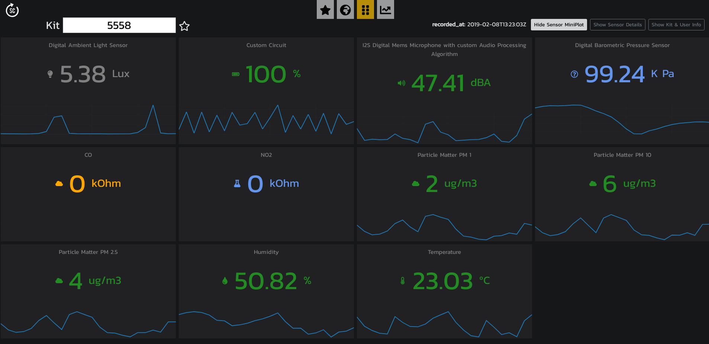

# Smart Citizen dashboard

A simple way to view your data. You visit the webpage and give it the ID of a Smart Citizen kit




### Development

This project was bootstrapped with [Create React App](https://github.com/facebookincubator/create-react-app).

Install dependencies

`npm start`

Start project:

`npm install`

Deploy to Github:

`npm run deploy`


### Running the Dashboard on a Raspberry Pi connected to a TV

You can run your own dashboard connected to a TV. This example uses the `Raspbian` on a Raspberry Pi 3.

1. SSH into the pi and edit this file with `nano` or `vi`:

`vi .config/lxsession/LXDE-pi/autostart`

2. Add this content to the file
```bash
@lxpanel --profile LXDE-pi
@pcmanfm --desktop --profile LXDE-pi
@point-rpi
@xset s noblank
@xset s off
@xset -dpms

@/usr/bin/chromium-browser --kiosk --disable-session-crashed-bubble https://dashboard.smartcitizen.me
```

3. Reboot the Pi. When it reboots it should start Chromium on the website
